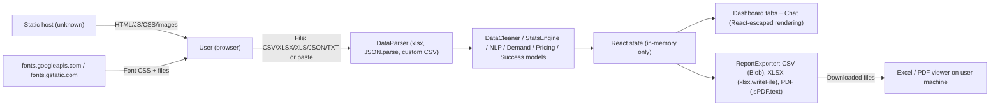

# Threat Model — Yuktivya AI (market-intelligence-app)

> Assessment date: 2026-10-07 · Scope: full repository at `market-intelligence-app/` (HEAD `a8fc049`)
> Method: manual source review of every file under `src/`, `public/`, root config, git history scan, and `npm audit` (read-only). No code was modified.

## Finding classification legend

| Label | Meaning |
|---|---|
| **Confirmed vulnerability** | Exploitable flaw proven by code/dependency evidence |
| **Security weakness** | Insecure pattern present in code; exploitation limited or context-dependent |
| **Missing control** | Expected protection that does not exist in the project |
| **Potential risk (verify)** | Cannot be confirmed from the repository alone; needs verification |
| **Recommendation** | Hardening / hygiene improvement, not a defect |

---

## 1. System overview (as implemented)

| Aspect | Actual implementation | Evidence |
|---|---|---|
| Architecture | Static single-page app (React 19 + Vite 8 + TypeScript). **No backend, no server code, no API routes.** | `package.json` scripts (`vite`, `vite build`, `vite preview`); no server files tracked in `git ls-files` |
| Data processing | 100% in-browser (parsing, cleaning, stats, sentiment, demand, pricing, "AI analyst") | `src/engine/*.ts` |
| "AI Analyst" | Local rule-based keyword matcher; **no LLM / external AI API** | `src/engine/aiAnalystEngine.ts` (`answerQuery` uses `q.includes(...)`) |
| Network calls | None for app data. Grep for `fetch(`, `axios`, `XMLHttpRequest`, `WebSocket` in `src/` → **0 matches** | grep results |
| Persistence | None. No `localStorage`, `sessionStorage`, `indexedDB`, cookies | grep results (0 matches) |
| Authentication / authorization | **None exists** (no login, users, roles) | No auth code anywhere in `src/` |
| Database | **None** | No DB client in `package.json` |
| Secrets | **None used** (no `import.meta.env`, no `process.env`, no `.env` files, none in git history) | grep + git history scan |
| External resources at runtime | Google Fonts (CSS + font files) | `index.html` L18–20, `src/index.css` L1 |
| Routing | Hash-based tab switching (`window.location.hash`) | `src/App.tsx` L31, L78 |
| Deployment config | **None in repo** (no Dockerfile, nginx, Vercel/Netlify/Firebase config, CI workflows) | `git ls-files`, git history file list |
| Source hosting | GitHub remote `Shivam-kumar-92/AI-analytics-` | `git remote -v`, `README.md` L95 |

### Data flow

---

## 2. Assets

| ID | Asset | Sensitivity | Where it lives |
|---|---|---|---|
| A1 | User-uploaded business datasets (sales, prices, reviews, possibly PII in review text) | **High** (confidential business data) | Browser memory only (`App.tsx` React state) |
| A2 | Generated reports (CSV / XLSX / PDF) | High (derived confidential data) | User's download folder |
| A3 | Integrity of analysis output (scores, verdicts, recommendations) | Medium (business decisions depend on it) | `src/engine/*` computations |
| A4 | Application code & build artefacts (supply chain) | Medium | GitHub repo, `node_modules`, `dist/`, static host |
| A5 | Availability of the user's browser tab | Low | Client |
| A6 | Embedded demo datasets (synthetic, public by design) | Low | `src/datasets/*.ts` |

There are **no** credentials, sessions, user accounts, or server-side data stores to protect.

---

## 3. Trust boundaries

| ID | Boundary | Crossing |
|---|---|---|
| TB1 | **Untrusted file/paste content → in-browser parser** | `DataUploader.handleFiles` / `handlePasteSubmit` → `DataParser` → `xlsx` |
| TB2 | **App output → external desktop software** (Excel/LibreOffice/Sheets, PDF reader) | `ReportExporter` downloads |
| TB3 | **Static host / CDN → browser** (code delivery) | Hosting is not defined in repo |
| TB4 | **Third-party origin (Google Fonts) → browser** | `<link>` in `index.html`, `@import` in `index.css` |
| TB5 | **npm registry → build** (supply chain) | `package.json` / `package-lock.json` |
| TB6 | **URL hash → app state** | `getHashTab()` in `App.tsx` |

---

## 4. Actors

| Actor | Capability | Motivation |
|---|---|---|
| Legitimate user | Uploads own data, exports reports | — |
| **Malicious dataset author** | Crafts a spreadsheet/CSV or authors review text (e.g. public product reviews later scraped into a dataset) | Code execution on analyst's desktop via exported CSV, tab DoS, prototype pollution |
| Malicious link sender | Sends a URL with a crafted `#hash` | Low — hash only selects a tab |
| Compromised dependency / registry | Ships malicious code into the bundle | Data theft from browser |
| Compromised / misconfigured static host | Serves modified JS | Data exfiltration (A1) |
| Third-party font provider | Observes visitor IP / referrer | Privacy |

---

## 5. Entry points

| ID | Entry point | Location |
|---|---|---|
| EP1 | File input + drag-and-drop (`.csv,.xlsx,.xls,.json,.txt`) | `src/components/upload/DataUploader.tsx` L122–146 |
| EP2 | Paste textarea | `DataUploader.tsx` L189–195 |
| EP3 | Chat input (free text) | `src/components/chat/AiAnalystChat.tsx` L216–223 |
| EP4 | Navbar "Specify industry..." text input (desktop + mobile variants, shown when industry = "Other") | `src/components/layout/Navbar.tsx` L166–172, L360–366 |
| EP5 | URL hash | `src/App.tsx` L31, L69–75 |
| EP6 | Export buttons (CSV / XLSX / PDF) | `src/components/export/ReportExporter.tsx` |
| EP7 | Build/install pipeline (`npm install`, `npm run build`) | `package.json` |

---

## 6. Threats, scenarios, and risk rating

Likelihood / Impact scale: Low · Medium · High. Severity = combined judgement in this app's context.

| ID | Threat (STRIDE) | Attack scenario | Likelihood | Impact | Severity | Class |
|---|---|---|---|---|---|---|
| T1 | Tampering / EoP — **Prototype pollution in `xlsx@0.18.5`** (GHSA-4r6h-8v6p-xvw6) | Attacker sends a crafted `.xlsx`; user uploads it; `XLSX.read()` in `dataParser.ts` L101 pollutes `Object.prototype` in the tab, corrupting analysis or enabling gadget-based script execution | Medium | High (advisory CVSS 7.8) | **High** | Confirmed vulnerability (vulnerable version on reachable path) |
| T2 | DoS — **ReDoS in `xlsx@0.18.5`** (GHSA-5pgg-2g8v-p4x9) | Crafted workbook freezes the tab during parse | Medium | Low (single tab, no server) | **Medium** | Confirmed vulnerability |
| T3 | Tampering / code execution on desktop — **CSV formula injection** | Review text such as `=HYPERLINK(...)` or `=cmd\|...` survives parsing/cleaning and is written verbatim by `XLSX.utils.sheet_to_csv` (`ReportExporter.tsx` L59–60). Opening the "Cleaned CSV" in Excel evaluates it | Medium (review datasets are third-party authored) | Medium–High (data exfiltration via formulas, DDE prompts) | **Medium** | Confirmed vulnerability |
| T4 | DoS — unbounded input size | Very large file is read fully into memory (`file.arrayBuffer()` / `file.text()`); UI text says "Max 50MB" but **no check exists** | Low | Low | **Low** | Missing control |
| T5 | DoS — stack overflow on large numeric columns | `Math.min(...numValues)` / `Math.max(...)` (`dataCleaner.ts` L61–62, `marketValueModel.ts` L15–16) throw `RangeError` above ~10⁵ values; caught by `try` in `DataUploader`, analysis fails | Low | Low | **Low** | Security weakness |
| T6 | Information disclosure / tampering — **compromised host or missing CSP** | If any script injection ever occurs (e.g. via T1 gadget or dependency compromise), nothing restricts where in-memory datasets can be sent | Low | High | **Medium** | Missing control (CSP/headers) + Potential risk (hosting unknown) |
| T7 | Supply chain | Malicious update to a dependency with caret ranges (`^`) on next `npm install` without lockfile enforcement | Low | High | **Medium** | Missing control (no automated dependency scanning / CI) |
| T8 | Info disclosure (privacy) — Google Fonts | Every visitor's IP/UA/referrer sent to Google | High (always) | Low | **Low** | Recommendation |
| T9 | XSS in jsPDF's DOMPurify (`dompurify@3.4.15`, GHSA-p98j-92pf-mc4p, GHSA-6688-9rhm-gjv2) | Only reachable via `jsPDF.html()`; project uses only `doc.text()` | Very low | Medium | **Low** | Potential risk (not reachable today) |
| T10 | DoS of build tooling — `source-map-js` (GHSA-68fv-2mgg-jv7q) | Build-time only; not shipped to users | Very low | Low | **Low** | Recommendation |
| T11 | Repudiation / integrity of reports | PDF footer prints "Verified Dataset Analysis" for **any** non-demo upload (`ReportExporter.tsx` L252) — a forged/edited dataset yields a report labelled "verified" | Medium | Low–Medium | **Low** | Security weakness |
| T12 | Spoofing via URL hash | `#anything` sets `activeTab`; values are only compared against fixed strings in `App.tsx` L242–314, never rendered as HTML | Very low | None observed | **Info** | No issue (verified) |
| T13 | XSS via uploaded content | Cell values, file names, product name, chat text rendered through JSX text nodes only | Very low | — | **Info** | Mitigated (verified) |

---

## 7. Existing mitigations (verified in code)

| Control | Evidence |
|---|---|
| **No server / no data transmission** — uploaded data never leaves the browser | 0 matches for `fetch(`, `axios`, `XMLHttpRequest`, `WebSocket` in `src/` |
| **No persistence** — data is cleared on reload | 0 matches for `localStorage`, `sessionStorage`, `indexedDB`, `document.cookie` |
| **React auto-escaping everywhere**; no raw HTML sinks | 0 matches for `dangerouslySetInnerHTML`, `innerHTML`, `outerHTML`, `insertAdjacentHTML`, `document.write`, `eval(`, `new Function` |
| Chat renders text with CSS `whitespace-pre-line`, not a Markdown/HTML renderer | `AiAnalystChat.tsx` L160 |
| Preview table renders cells as `String(val)` text | `DataPreviewTable.tsx` L189–191 |
| PDF generated with `doc.text()` / `splitTextToSize()` only (no HTML rendering) | `ReportExporter.tsx` L115–263 |
| XLSX export writes values as typed cells via `json_to_sheet` (strings are not stored as formulas) | `ReportExporter.tsx` L75–111 |
| JSON parsed with `JSON.parse` (no reviver, no eval) | `dataParser.ts` L79 |
| Custom CSV parser assigns only primitive values, so a `__proto__` header cannot replace the prototype | `dataParser.ts` L44–48, `autoCastValue` returns string/number/boolean |
| Parse errors caught and shown as text | `DataUploader.tsx` L61–62, L79–80 |
| Hash value used only for equality comparisons | `App.tsx` L242–314 |
| `dist/`, `node_modules`, `*.local`, logs are git-ignored | `.gitignore` |
| Lockfile committed | `package-lock.json` tracked |
| No secrets in current tree or git history | History scan for key/token/password/private-key patterns → 0 matches |

## 8. Missing mitigations

| ID | Missing mitigation | Addresses |
|---|---|---|
| M1 | Upgrade SheetJS to ≥ 0.20.2 from the official SheetJS CDN (npm registry is frozen at 0.18.5) | T1, T2 |
| M2 | Neutralise formula-trigger characters (`=`, `+`, `-`, `@`, TAB, CR) in exported CSV string cells | T3 |
| M3 | Enforce file-size and row/column limits before parsing; match the "Max 50MB" UI claim | T4, T2 |
| M4 | Replace spread-based `Math.min/max` with loop/reduce | T5 |
| M5 | Content-Security-Policy + security headers at the hosting layer (`default-src 'self'`, `connect-src 'self'`, `frame-ancestors 'none'`, etc.) | T6 |
| M6 | Dependency scanning (Dependabot / `npm audit` in CI), `npm ci` for builds | T7, T9, T10 |
| M7 | Self-host fonts or document third-party font usage in a privacy notice | T8 |
| M8 | Change "Verified Dataset Analysis" wording to "User-Supplied Dataset" | T11 |
| M9 | Add `.env*` to `.gitignore` proactively before any secrets are introduced | Future secrets |

See [`security-checklist.md`](./security-checklist.md) for the full finding list with fixes, and [`attack-surface.md`](./attack-surface.md) / [`secrets.md`](./secrets.md) for detail.

## 9. Out-of-scope / not applicable (with reason)

| Area | Status |
|---|---|
| Authentication, sessions, tokens | Not implemented: no users or login in the code |
| Authorization / RBAC / admin | Not implemented: there is no admin surface |
| Server APIs, webhooks, rate limiting, CORS | Not applicable: there is no server |
| Database / SQL / NoSQL injection | Not applicable: there is no database |
| Server-side file storage | Not applicable: files are processed in memory only |

> [!IMPORTANT]
> All of these become **in scope immediately** if a backend, real LLM API, user accounts, or cloud storage is added. Today the README's "AI" branding refers only to local heuristics.
